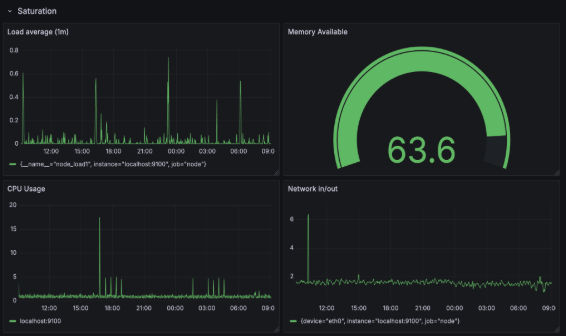
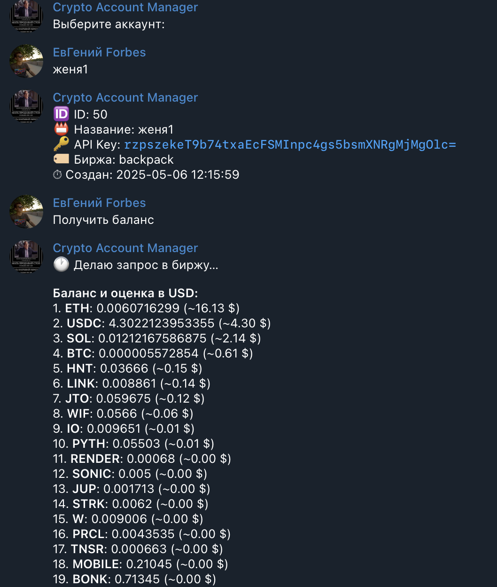
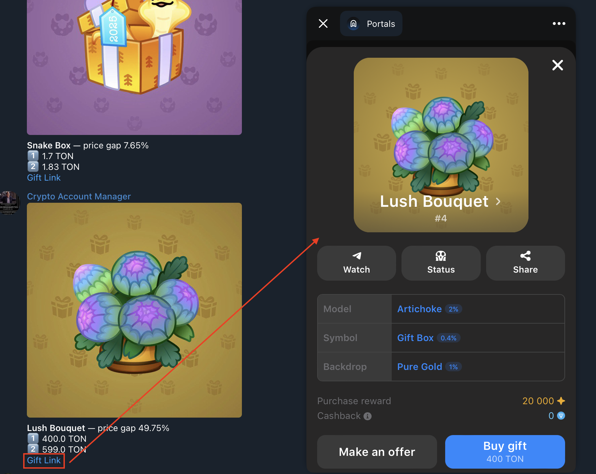

# Telegram-бот для автоматического трейдинга и мониторинга

## Описание проекта

Данный проект представляет собой многофункциональный Telegram-бот, предназначенный для автоматизации трейдинга и мониторинга специальных активов. Бот позволяет управлять несколькими торговыми аккаунтами, объединять их в «пулы» для автоматической торговли на крипто-платформе (например, **Backpack Exchange**), а также отслеживать редкие цифровые активы, такие как **NFT-подарки** в экосистеме TON/Telegram. Помимо основного бота, проект включает фоновые сервисы для сбора метрик и отслеживания выгодных предложений, которые уведомляют в Telegram о важных событиях (например, появление сильно недооцененного NFT-подарка). Все ключевые показатели работы бота и сервисов собираются через Prometheus и могут визуализироваться в Grafana для удобного мониторинга работы системы.

## Основные компоненты проекта

* **Telegram-бот (Aiogram)** – основной модуль, реализующий взаимодействие с пользователем через команды и сообщения в Telegram. С его помощью можно добавлять и удалять торговые аккаунты, просматривать их баланс и статистику, объединять аккаунты в **пулы** для автоматической торговли, управлять прокси-серверами для аккаунтов, добавлять «друзей» (реферальные связи) и другие функции. Бот использует библиотеку Aiogram 3.x и хранит состояние диалогов в Redis (FSM-хранилище).

* **Фоновый воркер “Trading Pools”** – сервис, выполняющий автоматические торговые операции для пулов аккаунтов. В цикле он обходит все активные пулы, получает по каждому пулу список привязанных аккаунтов и их балансы/позиции на разных биржах, после чего выполняет стратегию: если на аккаунте нет активов – покупает определённый токен по рынку, если есть позиции – продаёт самый дорогой токен. Таким образом реализуется простейшая торговая стратегия для каждого аккаунта в пуле. Воркер работает непрерывно, с заданным интервалом, и экспонирует метрики производительности (длительность цикла, количество операций и т.д.) через Prometheus.

* **Фоновый воркер “Telegram Gifts”** – модуль мониторинга рынка подарков **TON**. Существует целый перечень уникальных «подарков» в экосистеме Telegram (список включает предметы вроде *“Durov's Cap”, “Heart Locket”, “Eternal Rose”* и т.д.), которыми пользователи могут обмениваться. Эти подарки представлены в виде NFT на блокчейне TON и торгуются на маркетплейсах. Данный воркер циклически запрашивает API платформы `tonnel.network` для получения актуальных цен по каждому подарку и измеряет **минимальные, 3-и и 5-и по дешевизне предложения** на рынке для каждого вида подарка. Полученные цены сохраняются в метриках Prometheus (`gifts_price{gift="<название>", rank="<ранг>"}`), а при необходимости могут быть использованы ботом для оповещения о выгодных ценах.

* **Фоновый воркер “Portals NFT Monitor”** – модуль отслеживания редких предложений на NFT-маркетплейсе **Portals**. Portals – это площадка (и Telegram Mini App) для торговли NFT-подарками Telegram. Воркер запрашивает цены коллекций на `portals-market.com` и вычисляет разницу между самым дешевым и вторым по цене предложением в каждой коллекции. Эта **ценовая дельта** (gap) отражает, насколько первое предложение дешевле рынка. Если разница превышает заданный порог (по умолчанию 10%), воркер автоматически отправляет сообщение в Telegram с информацией о найденном дешевом лоте (название коллекции, цена первого и второго лотов, процент разницы) и ссылкой на покупку через Portals. Кроме того, воркер экспонирует метрики по ценам (`portals_nft_price{collection="<коллекция>", rank="1/2"}` для 1-го и 2-го цен и `portals_price_gap_percent{collection="<коллекция>"}` для разницы в процентах) через Prometheus.

* **База данных (PostgreSQL)** – используется для хранения данных проекта: пользователи бота, аккаунты и их привязки, пулы, связи “друзей” (рефералов) и прочая информация. Для управления схемой базы данных используются миграции Alembic (поставляются в директории `migrations`). При первом запуске необходимо применить все миграции, чтобы создать необходимые таблицы.

* **Кэш и FSM-хранилище (Redis)** – используется для двух целей: хранение состояний конечного автомата (Finite State Machine) Aiogram, чтобы бот мог поддерживать диалоги с пользователями, и для внутренних нужд приложения (например, кэширование данных, хранение промежуточных результатов). Redis запускается как отдельный сервис и доступен ботам и воркерам через URL.

* **Сбор метрик (Prometheus)** – система мониторинга, собирающая метрики со всех компонентов проекта. В комплекте поставляется конфигурация `prometheus.yml`, которая настраивает сбор метрик с каждого сервиса:

  * `telegram_bot:8000` – метрики от основного Telegram-бота (например, количество выполненных команд, время обработки сообщений и т.д.).
  * `backpack_worker:8001` – метрики от воркера торговых пулов (время выполнения цикла, число запросов к API биржи и пр.).
  * `tg_gifts_worker:8002` – метрики от воркера мониторинга подарков TON (цены подарков и др.).
  * `telegram_portal_worker:8003` – метрики от воркера мониторинга NFT (цены и ценовой разрыв по коллекциям).
    Prometheus хранит временные ряды метрик (в Docker-компоузе подключён том для хранения данных `metrics_data`) и предоставляет интерфейс для запросов (доступен на порту 9090).

* **Grafana (Dashboard)** – для визуализации метрик вы можете подключить Grafana. В состав проекта Grafana как сервис не включена, однако вы легко можете развернуть её отдельно и подключиться к Prometheus. Grafана позволит построить наглядные графики по метрикам бота: от времени отклика на команды до динамики цен NFT-подарков. ниже приведены рекомендации по настройке Grafana и описаны примеры дашбордов.
## Скриншоты

### Скриншот интерфейса Grafana с графиками

---

### Скриншот Telegram-бота

---

### Скриншот с подарками в Telegram

